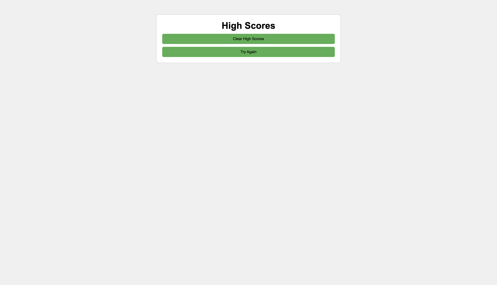

# Dane's Code Quiz Web 

Welcome to the Code Quiz Web Application! This interactive quiz tests your knowledge of HTML, CSS, and programming concepts. Challenge yourself with a series of questions, and see how quickly you can answer them.

## Getting Started

1. Clone this repository to your local machine.
2. Open the `index.html` file in your web browser.

## How to Play

- Click the "Start Quiz" button to begin.
- Answer each question by selecting the correct option.
- If you answer incorrectly, time will be deducted from the clock.
- The game ends when all questions are answered or the timer reaches 0.

## Features

- Timer display to keep track of your progress.
- Responsive design for seamless gameplay on different devices.
- Save your initials and score at the end of the quiz.

## Highscores

- After completing the quiz, view the highscores by clicking the "Save Score" button.
- Clear previous highscores or try the quiz again with dedicated buttons on the Highscores screen.

## Technologies Used

- HTML
- CSS
- JavaScript

## Web link

http://127.0.0.1:5501/Code-Quiz/index.html

## Web Image

